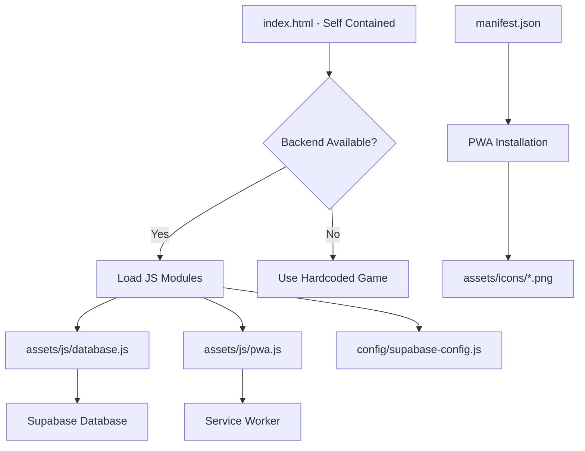

# 📁 LADDER - Codebase Structure Index

**Last Updated**: 2024-07-29  
**Total Files**: 10+  
**Total Directories**: 4

## 📊 **Overview**
- **Frontend**: Self-contained HTML with inline CSS, progressive enhancement with modular JS
- **Backend**: Supabase database with authentication & puzzle fetching
- **Architecture**: Simple, reliable, fast-loading single-page application
- **Deployment**: Zero build process - direct deployment of static files
- **Philosophy**: Self-contained by default, enhanced by backend when available

---

## 🗂️ **Directory Structure**

```
ladder_game/
├── 📁 assets/                    # Static resources & essential modules
│   ├── 📁 js/                    # Backend integration modules
│   │   ├── database.js           # 📊 Supabase integration & puzzle fetching
│   │   ├── game.js               # 🎮 Enhanced game logic (backend integration)
│   │   └── pwa.js                # 📱 PWA functionality & service worker
│   ├── 📁 icons/                 # App icons for PWA installation
│   │   └── icon.svg              # Source vector icon (LADDER design)
│   └── 📁 images/                # Additional graphics & media
├── 📁 config/                    # Configuration files
│   └── supabase-config.js        # Database connection configuration
├── 📁 docs/                      # Documentation files
│   ├── THEME_STRATEGY.md         # Puzzle design framework
│   ├── 90_THEMES_LIST.md         # Complete theme list
│   ├── SAMPLE_WEEK_PUZZLES.md    # Example puzzles
│   ├── PWA_SETUP.md              # Progressive Web App setup guide
│   └── ORGANIZATION_SUMMARY.md   # Project overview
├── 📁 tests/                     # Testing utilities
│   └── test-pwa.html             # PWA functionality test suite
├── 📄 index.html                 # 🌟 Self-contained main application
├── 📄 manifest.json              # 📱 PWA manifest (app installation)
├── 📄 sw.js                      # ⚙️ Service worker (smart caching)
├── 📄 README.md                  # Project overview & instructions
├── 📄 LICENSE                    # Software license
└── 📄 CODEBASE_INDEX.md          # 📋 This index file
```

---

## 📄 **File Details**

### **🌟 Core Application**
| File | Purpose | Dependencies | Architecture |
|------|---------|--------------|--------------|
| `index.html` | Self-contained game with inline CSS/JS | Optional: JS modules for backend | ~50KB monolithic |
| `manifest.json` | PWA configuration | `assets/icons/*` | ~1KB |
| `sw.js` | Smart caching service worker | None | ~2KB |

### **🔌 Backend Integration (Optional Enhancement)**
| File | Purpose | Responsibility | Fallback |
|------|---------|----------------|----------|
| `assets/js/database.js` | Supabase puzzle fetching | Real puzzle data from database | Hardcoded puzzles in HTML |
| `assets/js/pwa.js` | PWA registration & offline detection | Service worker management | Basic caching from sw.js |
| `assets/js/game.js` | Enhanced game logic | Advanced features & backend sync | Self-contained game in HTML |
| `config/supabase-config.js` | Database connection | API keys & client setup | Game works without backend |

### **📱 PWA Assets**
| File | Purpose | Status | Required For |
|------|---------|--------|--------------|
| `assets/icons/icon.svg` | Source vector icon | ✅ Ready | Icon generation |
| `assets/icons/icon-180.png` | iOS home screen icon | ⚠️ Generate needed | iOS PWA |
| `assets/icons/icon-192.png` | Android PWA icon | ⚠️ Generate needed | Android PWA |
| `assets/icons/icon-512.png` | High-resolution PWA icon | ⚠️ Generate needed | PWA manifest |

### **📚 Documentation**
| File | Purpose | Status | Last Updated |
|------|---------|--------|--------------|
| `docs/THEME_STRATEGY.md` | Puzzle design framework | ✅ Ready | 2024-07-29 |
| `docs/90_THEMES_LIST.md` | Complete theme catalog | ✅ Ready | 2024-07-29 |
| `docs/SAMPLE_WEEK_PUZZLES.md` | Example implementations | ✅ Ready | 2024-07-29 |
| `docs/PWA_SETUP.md` | Installation guide | ✅ Ready | 2024-07-29 |

---

## 🏗️ **Architecture Philosophy**

### **Self-Contained First**
- `index.html` contains all CSS and JavaScript inline
- Works perfectly with zero network dependencies
- Hardcoded puzzles provide immediate functionality
- No build process or external dependencies required

### **Progressive Enhancement**
- Backend modules enhance but don't replace core functionality
- If Supabase is unavailable, game continues with hardcoded puzzles
- PWA features are additive, not required
- Graceful degradation ensures universal compatibility

### **Simple Deployment**
- Upload all files to any web server
- No build process, compilation, or server-side requirements
- HTTPS recommended for PWA features
- Works immediately on any static hosting

---

## 🔗 **Dependency Flow**



---

## 🚀 **Quick Start**

### **Development Server**
```bash
# Start local development server
python3 -m http.server 8000

# Open in browser
open http://localhost:8000

# Test on mobile (same WiFi)
# Use your computer's IP: http://192.168.x.x:8000
```

### **Icon Generation (Required for PWA)**
```bash
# Convert assets/icons/icon.svg to PNG files:
# 1. Use online converter or design tool
# 2. Generate: icon-180.png, icon-192.png, icon-512.png
# 3. Place in assets/icons/ directory
```

### **Testing**
```bash
# Test PWA features
open http://localhost:8000/tests/test-pwa.html

# Test offline functionality
# 1. Load game in browser
# 2. Disconnect internet
# 3. Refresh page - should still work
```

---

## 📋 **Technical Details**

### **Frontend Stack**
- **HTML5**: Semantic structure with inline styles and scripts
- **CSS3**: Mobile-first responsive design, PWA-ready
- **Vanilla JavaScript**: ES6+ with module enhancement
- **Progressive Web App**: Offline-capable, installable

### **Backend Integration**
- **Supabase**: PostgreSQL database for puzzle storage
- **Optional Enhancement**: Game works without backend
- **Graceful Fallback**: Hardcoded puzzles when offline

### **Browser Support**
- **Modern Browsers**: Full functionality with PWA features
- **Legacy Browsers**: Core game works universally
- **Mobile**: Optimized for touch and small screens

---

## ⚠️ **Launch Checklist**

### **Required**
- [ ] Generate PWA icons from SVG
- [ ] Test core game functionality
- [ ] Verify responsive design on mobile

### **Recommended**
- [ ] Test PWA installation on mobile devices
- [ ] Verify Supabase backend integration
- [ ] Test offline functionality
- [ ] Confirm HTTPS deployment for PWA features

### **Optional Enhancements**
- [ ] Set up automated puzzle loading from Supabase
- [ ] Configure user authentication features
- [ ] Enable push notifications for daily puzzles

---

## 📝 **Maintenance**

### **Regular Tasks**
- **Daily**: Monitor game functionality
- **Weekly**: Review puzzle content and themes
- **Monthly**: Update documentation as needed

### **File Management**
- **Core Logic**: All in `index.html` - edit carefully
- **Backend**: Modify JS modules for enhanced features
- **Icons**: Regenerate if logo changes

---

## 📋 **Change Log**
| Date | Changes | Impact | Notes |
|------|---------|--------|-------|
| 2024-07-29 | **MAJOR: Architecture Cleanup** | Simplified structure | Removed modular CSS/JS architecture |
| 2024-07-29 | **Self-contained HTML** | Single file app | Inline CSS/JS for reliability |
| 2024-07-29 | **Backend Integration** | Enhanced features | Optional Supabase modules |
| 2024-07-29 | **Progressive Enhancement** | Better fallbacks | Works with or without backend |
| 2024-07-29 | **Documentation Update** | Current architecture | Updated this index file |

---

**📞 Maintenance Contact**: Keep this index updated with every architectural change!  
**🎯 Next Priority**: Generate PWA icons and test deployment