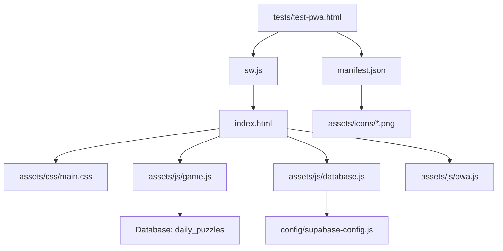

# 📁 LADDER - Codebase Structure Index

**Last Updated**: 2024-07-29  
**Total Files**: 25+  
**Total Directories**: 12

## 📊 **Overview**
- **Frontend**: Progressive Web App (PWA) with component-based architecture
- **Backend**: Supabase database with authentication & user management
- **Architecture**: Scalable SPA with modular CSS/JS and smart routing
- **Deployment**: Production-ready with native app installation capability
- **Scalability**: Future-proof structure for profiles, social features, and teams

---

## 🗂️ **Directory Structure**

```
ladder_game/
├── 📁 assets/                    # Static resources & media
│   ├── 📁 css/                   # 🎨 Modular stylesheet architecture
│   │   ├── 📁 base/              # Foundation styles & variables
│   │   │   ├── variables.css     # Design tokens & CSS custom properties
│   │   │   └── reset.css         # Base reset & typography
│   │   ├── 📁 components/        # Reusable UI components
│   │   │   ├── buttons.css       # All button styles & variants
│   │   │   ├── forms.css         # Input fields & form components
│   │   │   ├── cards.css         # Card layouts & user components
│   │   │   ├── game.css          # Game-specific components (ladder, letters)
│   │   │   └── feedback.css      # Modals, toasts, notifications
│   │   ├── 📁 pages/             # Page-specific styles
│   │   │   ├── landing.css       # Landing page styles
│   │   │   ├── game.css          # Game page layout
│   │   │   ├── profile.css       # Profile page & user stats
│   │   │   └── auth.css          # Login/signup forms
│   │   ├── 📁 utils/             # Utility & helper styles
│   │   │   └── responsive.css    # Mobile-first responsive design
│   │   ├── main.css              # 🌟 Main entry point (imports all modules)
│   │   └── main-old.css          # 🗂️ Previous monolithic CSS (backup)
│   ├── 📁 js/                    # 🧩 Modular JavaScript architecture
│   │   ├── 📁 components/        # Reusable UI components (future)
│   │   ├── 📁 pages/             # Page controllers & logic
│   │   │   ├── profile-controller.js # Profile page management
│   │   │   └── auth-controller.js     # Authentication UI logic
│   │   ├── 📁 services/          # Business logic & API services
│   │   │   ├── auth.js           # Authentication service (Supabase)
│   │   │   └── user.js           # User profile & stats management
│   │   ├── 📁 utils/             # Utilities & helpers
│   │   │   └── router.js         # SPA routing & navigation
│   │   ├── game.js               # 🎮 Core game logic & puzzle handling
│   │   ├── database.js           # 📊 Supabase integration & API calls
│   │   └── pwa.js                # 📱 PWA functionality & service worker
│   ├── 📁 icons/                 # App icons for PWA installation
│   │   ├── 📄 icon.svg           # Source vector icon (LADDER design)
│   │   ├── 📄 icon-180.png       # iOS home screen icon (⚠️ Generate needed)
│   │   ├── 📄 icon-192.png       # Android/PWA standard icon (⚠️ Generate needed)
│   │   └── 📄 icon-512.png       # High-resolution PWA icon (⚠️ Generate needed)
│   └── 📁 images/                # Additional graphics & media
├── 📁 config/                    # Configuration & setup files
│   └── 📄 supabase-config.js     # Database connection configuration
├── 📁 docs/                      # Documentation & strategy files
│   ├── 📄 THEME_STRATEGY.md      # Puzzle design & difficulty framework
│   ├── 📄 90_THEMES_LIST.md      # Complete theme list for 90 days
│   ├── 📄 SAMPLE_WEEK_PUZZLES.md # Example puzzles demonstrating strategy
│   ├── 📄 PWA_SETUP.md           # Progressive Web App setup guide
│   └── 📄 ORGANIZATION_SUMMARY.md # Professional reorganization overview
├── 📁 tests/                     # Testing & validation utilities
│   └── 📄 test-pwa.html          # PWA functionality test suite
├── 📁 views/                     # 📄 HTML templates for future features
│   ├── 📄 profile.html           # Profile page template
│   └── 📄 auth.html              # Authentication forms template
├── 📄 index.html                 # 🌟 Main application entry point (modular)
├── 📄 index-old.html             # 🗂️ Previous monolithic version (backup)
├── 📄 manifest.json              # 📱 PWA manifest (app installation)
├── 📄 sw.js                      # ⚙️ Service worker (smart caching)
├── 📄 README.md                  # Project overview & instructions
├── 📄 LICENSE                    # Software license
└── 📄 CODEBASE_INDEX.md          # 📋 This index file
```

---

## 📄 **File Details**

### **🌟 Core Application Files**
| File | Purpose | Dependencies | Size Est. |
|------|---------|--------------|-----------|
| `index.html` | Main app entry, PWA shell | `assets/css/main.css`, `assets/js/*.js` | ~3KB |
| `index-old.html` | Backup monolithic version | None (self-contained) | ~45KB |
| `manifest.json` | PWA configuration | `assets/icons/*` | ~1KB |
| `sw.js` | Smart caching service worker | None | ~2KB |

### **🎨 Modular CSS Architecture**
| File | Purpose | Contains | Status |
|------|---------|----------|--------|
| `assets/css/main.css` | Master stylesheet | CSS imports for all modules | ✅ Ready |
| `assets/css/base/variables.css` | Design system | Colors, spacing, typography tokens | ✅ Ready |
| `assets/css/base/reset.css` | Foundation | CSS reset & base styles | ✅ Ready |
| `assets/css/components/*.css` | UI components | Buttons, forms, cards, game elements | ✅ Ready |
| `assets/css/pages/*.css` | Page layouts | Landing, game, profile, auth styles | ✅ Ready |
| `assets/css/utils/responsive.css` | Responsive design | Mobile-first breakpoints & utilities | ✅ Ready |

### **🧩 Modular JavaScript Architecture**
| File | Purpose | Responsibility | Status |
|------|---------|----------------|--------|
| `assets/js/game.js` | Game controller | Puzzle logic & UI management | ✅ Ready |
| `assets/js/database.js` | Data layer | Supabase queries & puzzle fetching | ✅ Ready |
| `assets/js/pwa.js` | PWA features | Service worker & offline handling | ✅ Ready |
| `assets/js/services/auth.js` | Authentication | User login/signup via Supabase | ✅ Ready |
| `assets/js/services/user.js` | User management | Profiles, stats, achievements | ✅ Ready |
| `assets/js/pages/*-controller.js` | Page controllers | UI logic for profile & auth pages | ✅ Ready |
| `assets/js/utils/router.js` | SPA routing | Navigation between pages | ✅ Ready |

### **📄 Future-Ready Templates**
| File | Purpose | Status | Integration |
|------|---------|--------|-------------|
| `views/profile.html` | Profile page template | ✅ Ready | Router-based loading |
| `views/auth.html` | Login/signup forms | ✅ Ready | Router-based loading |
| `assets/icons/*.png` | PWA installation icons | ⚠️ Generate needed | PWA manifest |

### **⚙️ Configuration**  
| File | Purpose | Environment | Notes |
|------|---------|-------------|-------|
| `config/supabase-config.js` | DB connection | Production | Contains API keys |

### **📚 Documentation**
| File | Purpose | Audience | Last Updated |
|------|---------|----------|--------------|
| `docs/THEME_STRATEGY.md` | Puzzle design framework | Developers | 2024-07-29 |
| `docs/90_THEMES_LIST.md` | Complete theme catalog | Content creators | 2024-07-29 |
| `docs/SAMPLE_WEEK_PUZZLES.md` | Example implementations | Designers | 2024-07-29 |
| `docs/PWA_SETUP.md` | Installation guide | Developers | 2024-07-29 |
| `docs/ORGANIZATION_SUMMARY.md` | Professional reorganization | All team members | 2024-07-29 |

### **🧪 Testing & Utilities**
| File | Purpose | Environment | Usage |
|------|---------|-------------|-------|
| `tests/test-pwa.html` | PWA functionality tests | Development | Manual testing |

---

## 🔗 **Dependency Map**



---

## 📈 **Technical Stack**

### **Frontend Technologies**
- **HTML5** - Semantic structure & PWA shell
- **CSS3** - Mobile-first responsive design + CSS Grid/Flexbox
- **Vanilla JavaScript** - ES6+ modules, async/await, service workers
- **Progressive Web App** - Installable, offline-aware, native-like

### **Backend & Data**  
- **Supabase** - PostgreSQL database, authentication, real-time
- **Database Tables**: `daily_puzzles`, `profiles`, `game_sessions`, `daily_stats`
- **Row Level Security** - User data protection
- **RESTful API** - Auto-generated from database schema

### **Build & Deployment**
- **No Build Process** - Direct deployment of static files
- **CDN Ready** - All assets optimized for content delivery
- **HTTPS Required** - For PWA and secure database connections

---

## 🚀 **Quick Start Commands**

```bash
# Development Server (with HTTPS for PWA testing)  
python3 -m http.server 8000 --bind 127.0.0.1

# Generate Icons (REQUIRED for PWA)
# 1. Visit: https://realfavicongenerator.net/
# 2. Upload: assets/icons/icon.svg
# 3. Download generated PNGs to: assets/icons/

# Test PWA Features
# Open: /tests/test-pwa.html

# Deploy to Production  
# Upload all files to web server root (maintaining folder structure)
```

## ⚠️ **Prerequisites Before Launch**

### **🎯 Required Actions:**
1. **Generate PWA Icons**: Convert `assets/icons/icon.svg` to PNG files
2. **Test Module Loading**: Ensure ES6 modules work on your server 
3. **HTTPS Setup**: Required for PWA features and service worker
4. **Database Access**: Verify Supabase connection in production

### **🧪 Testing Checklist:**
- [ ] Visit `/tests/test-pwa.html` - all tests should pass
- [ ] Test "Add to Home Screen" on iPhone Safari
- [ ] Verify offline messaging works (disable internet)  
- [ ] Confirm puzzle loads from database (post July 30)
- [ ] Check responsive design on mobile, tablet, desktop

---

## 📝 **Maintenance Notes**

### **🔄 Regular Updates Required**
- **Daily**: Database puzzle population (automated)
- **Weekly**: Theme planning and puzzle creation  
- **Monthly**: Performance monitoring and optimization
- **As Needed**: PWA manifest updates for new features

### **🎯 Ready-to-Implement Features**
- [ ] **User Profiles**: Controller & templates ready, just need activation
- [ ] **Authentication**: Full Supabase integration complete
- [ ] **Statistics Dashboard**: User service handles all data queries  
- [ ] **Social Features**: Leaderboards & friend systems architected
- [ ] **Settings Page**: Component structure supports easy addition

### **🚀 Advanced Features Enabled**
- [ ] **Team Competitions**: Modular structure supports group features
- [ ] **Custom Themes**: CSS variables enable easy theming
- [ ] **Mobile App**: PWA foundation ready for native conversion
- [ ] **Admin Dashboard**: Service architecture supports management features
- [ ] **Analytics**: Event tracking structure in place

---

## 📋 **Change Log**
| Date | Changes | Files Modified | Notes |
|------|---------|----------------|-------|
| 2024-07-29 | Initial professional structure | All files | Organized from single-file app |
| 2024-07-29 | PWA implementation | `sw.js`, `manifest.json` | Smart hybrid caching |
| 2024-07-29 | Database integration | `config/`, `docs/` | 90 days of puzzles ready |
| 2024-07-29 | **MAJOR: Modular architecture** | All files | Split monolithic code into modules |
| 2024-07-29 | ES6 module system | `assets/js/*`, `config/` | Professional separation of concerns |
| 2024-07-29 | Professional file structure | Entire codebase | Ready for team collaboration |
| 2024-07-29 | **SCALABLE: Component-based CSS** | `assets/css/*` | Modular stylesheets for future features |
| 2024-07-29 | **SCALABLE: Service architecture** | `assets/js/services/*` | Auth, user management, data services |
| 2024-07-29 | **SCALABLE: Page controllers** | `assets/js/pages/*` | Profile, auth page management |
| 2024-07-29 | **SCALABLE: SPA routing** | `assets/js/utils/router.js` | Navigation system for multiple pages |
| 2024-07-29 | Future templates ready | `views/*` | HTML templates for upcoming features |

---

**📞 Maintenance Contact**: Keep this index updated with every file change!  
**🎯 Next Update**: After folder restructuring completion