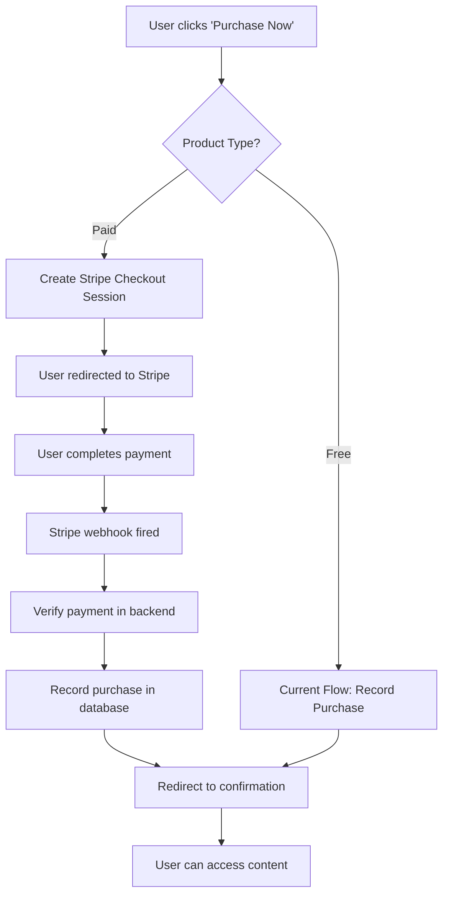

# Stripe Payment Integration Plan for LADDER Game

## Overview

This document outlines the complete integration plan for adding Stripe payment processing to the LADDER game platform. The integration will transform the current free-claim system into a robust payment system while maintaining the existing user experience.

## Current System Analysis

### **Product Catalog Architecture**
The **`store.html`** page serves as the **primary product catalog** where users browse and purchase content:

**Store Layout**:
- **"My Puzzles" Section**: Shows owned packs (auto-populated from `user_purchases`)
- **"Store" Section**: Shows available products for purchase
- **Smart Display Logic**: Owned products are hidden from store, shown in "My Puzzles"
- **Navigation**: `Home → Store → Product Overview → Purchase/Claim → Confirmation`

**Home Screen Integration**:
- Shows **owned content** in "My Puzzles" section 
- **"Browse puzzles" button** → directs to `store.html`
- **Store integration** but main catalog lives in `store.html`

### **Existing Purchase Flow**
1. **Product Discovery**: Users browse products primarily on `store.html` (main catalog), with some display on `home.html`
2. **Product Selection**: Users click product cards → navigate to `product-overview.html`
3. **Purchase Action**: Users click "Claim Now" (free) or "Purchase Now" (paid)
4. **Database Recording**: Purchase recorded in `user_purchases` table with `payment_method: 'free_claim'`
5. **Confirmation**: Users see `purchase-confirmation.html` with clean success animation (animated checkmark, no confetti)
6. **Access**: Users can access purchased content through pack-specific pages

### **Current Database Schema**
```sql
-- Existing tables that support payment integration
user_purchases (
  id UUID PRIMARY KEY,
  user_id UUID REFERENCES auth.users,
  product_id TEXT,              -- 'free-pack', 'complete-pack', etc.
  product_name TEXT,
  price_cents INTEGER,          -- Already in cents format!
  payment_method TEXT,          -- Currently 'free_claim'
  purchase_date TIMESTAMPTZ,
  status TEXT                   -- 'completed', 'pending', 'failed'
)

puzzle_packs (
  id TEXT PRIMARY KEY,          -- 'free-pack', 'complete-pack'
  name TEXT,
  description TEXT,
  total_puzzles INTEGER,
  price_cents INTEGER,          -- 0 for free, 499 for $4.99
  sort_order INTEGER,
  is_active BOOLEAN
)
```

### **Current Products & Pricing**
- **Free Pack**: $0.00 (10 puzzles, levels 1-7)
- **Complete Pack**: $4.99 (100 puzzles, all levels)
- **Puzzle Pack**: $2.99 (100 puzzles, curated)
- **Archive**: $2.99 (historical daily puzzle access)

## Stripe Integration Architecture

### **Integration Strategy: Maximum Customer Convenience**
We'll use [Stripe Checkout](https://stripe.com/docs/checkout) for the **smoothest possible customer experience**:

**Why Stripe Checkout is Perfect for LADDER**:
- ✅ **Zero friction**: No form filling, pre-built mobile-optimized UI
- ✅ **One-click payments**: Apple Pay, Google Pay, Link (saved payment methods)
- ✅ **Trust indicators**: Customers see "Powered by Stripe" → instant trust
- ✅ **Mobile optimized**: Perfect for puzzle game's mobile-first audience
- ✅ **Global ready**: Supports international cards and currencies
- ✅ **Security built-in**: PCI compliance, 3D Secure, fraud protection handled automatically

**Customer Journey Optimization**:
1. **Same button experience**: "Claim Now" (free) vs "Purchase Now" (paid) - no confusion
2. **Instant redirect**: Click → Stripe Checkout (no loading screens or complex forms)
3. **Fast completion**: Most payments complete in under 30 seconds
4. **Familiar confirmation**: Same success page design for free and paid purchases
5. **Immediate access**: Content unlocked immediately after payment

### **Payment Flow Design**



## Implementation Plan

### **Key Design Principles for Customer Experience**

**🎯 Goal: Make buying as easy as claiming free content**

1. **Seamless Integration**: 
   - Same store interface for free and paid products
   - Identical button styling and behavior
   - No separate "payment pages" or complex flows

2. **Trust & Security**:
   - Stripe's trusted payment interface (customers recognize it)
   - No card details stored on your servers
   - Professional checkout experience builds confidence

3. **Mobile-First Design**:
   - Stripe Checkout is perfectly optimized for mobile
   - Apple Pay/Google Pay for instant purchases
   - Touch-friendly interface

4. **Error Prevention**:
   - Clear duplicate purchase prevention
   - Automatic authentication checks
   - Smart error messages and recovery

### **Phase 1: Infrastructure Setup (Week 1)**

#### **1.1 Stripe Account & Configuration**
- [ ] Create Stripe account for the business
- [ ] Set up test environment with test keys
- [ ] Configure Stripe dashboard settings
- [ ] Set up webhook endpoints

#### **1.2 Environment Variables**
```javascript
// Add to Supabase Edge Function environment
STRIPE_SECRET_KEY=sk_test_...
STRIPE_PUBLISHABLE_KEY=pk_test_...
STRIPE_WEBHOOK_SECRET=whsec_...
```

#### **1.3 Database Schema Updates**
```sql
-- Add Stripe-specific fields to user_purchases
ALTER TABLE user_purchases ADD COLUMN stripe_payment_intent_id TEXT;
ALTER TABLE user_purchases ADD COLUMN stripe_checkout_session_id TEXT;
ALTER TABLE user_purchases ADD COLUMN transaction_id TEXT;

-- Add payment tracking table
CREATE TABLE payment_transactions (
  id UUID PRIMARY KEY DEFAULT gen_random_uuid(),
  user_id UUID REFERENCES auth.users,
  stripe_payment_intent_id TEXT UNIQUE,
  stripe_checkout_session_id TEXT UNIQUE,
  amount_cents INTEGER,
  currency TEXT DEFAULT 'usd',
  status TEXT, -- 'pending', 'succeeded', 'failed', 'canceled'
  created_at TIMESTAMPTZ DEFAULT NOW(),
  updated_at TIMESTAMPTZ DEFAULT NOW()
);

-- Enable RLS
ALTER TABLE payment_transactions ENABLE ROW LEVEL SECURITY;
CREATE POLICY "Users can view their own transactions" ON payment_transactions
  FOR SELECT USING (auth.uid() = user_id);
```

### **Phase 2: Backend Integration (Week 2)**

#### **2.1 Create Stripe Checkout Edge Function**
Create `supabase/functions/create-stripe-checkout/index.ts`:

```typescript
import { createClient } from 'https://esm.sh/@supabase/supabase-js@2';
import Stripe from 'https://esm.sh/stripe@14.21.0';

const stripe = new Stripe(Deno.env.get('STRIPE_SECRET_KEY') || '', {
  apiVersion: '2023-10-16',
});

const supabase = createClient(
  Deno.env.get('SUPABASE_URL') ?? '',
  Deno.env.get('SUPABASE_SERVICE_ROLE_KEY') ?? ''
);

interface CheckoutRequest {
  product_id: string;
  success_url: string;
  cancel_url: string;
}

Deno.serve(async (req: Request) => {
  if (req.method !== 'POST') {
    return new Response('Method not allowed', { status: 405 });
  }

  try {
    // Get user from auth header
    const authHeader = req.headers.get('authorization');
    const token = authHeader?.replace('Bearer ', '');
    
    const { data: { user }, error: authError } = await supabase.auth.getUser(token);
    if (authError || !user) {
      throw new Error('Unauthorized');
    }

    const { product_id, success_url, cancel_url }: CheckoutRequest = await req.json();

    // Get product details from database
    const { data: product, error: productError } = await supabase
      .from('puzzle_packs')
      .select('*')
      .eq('id', product_id)
      .single();

    if (productError || !product) {
      throw new Error('Product not found');
    }

    // Create Stripe Checkout Session
    const session = await stripe.checkout.sessions.create({
      payment_method_types: ['card'],
      line_items: [
        {
          price_data: {
            currency: 'usd',
            product_data: {
              name: product.name,
              description: product.description,
            },
            unit_amount: product.price_cents,
          },
          quantity: 1,
        },
      ],
      mode: 'payment',
      success_url: success_url,
      cancel_url: cancel_url,
      metadata: {
        user_id: user.id,
        product_id: product_id,
        product_name: product.name,
      },
      customer_email: user.email,
    });

    // Record the pending transaction
    await supabase
      .from('payment_transactions')
      .insert({
        user_id: user.id,
        stripe_checkout_session_id: session.id,
        amount_cents: product.price_cents,
        status: 'pending',
      });

    return new Response(JSON.stringify({
      checkout_url: session.url,
      session_id: session.id,
    }), {
      headers: { 'Content-Type': 'application/json' },
    });

  } catch (error) {
    console.error('Stripe checkout error:', error);
    return new Response(JSON.stringify({
      error: error.message,
    }), {
      status: 400,
      headers: { 'Content-Type': 'application/json' },
    });
  }
});
```

#### **2.2 Create Stripe Webhook Handler**
Create `supabase/functions/stripe-webhook/index.ts`:

```typescript
import { createClient } from 'https://esm.sh/@supabase/supabase-js@2';
import Stripe from 'https://esm.sh/stripe@14.21.0';

const stripe = new Stripe(Deno.env.get('STRIPE_SECRET_KEY') || '', {
  apiVersion: '2023-10-16',
});

const supabase = createClient(
  Deno.env.get('SUPABASE_URL') ?? '',
  Deno.env.get('SUPABASE_SERVICE_ROLE_KEY') ?? ''
);

Deno.serve(async (req: Request) => {
  if (req.method !== 'POST') {
    return new Response('Method not allowed', { status: 405 });
  }

  try {
    const body = await req.text();
    const signature = req.headers.get('stripe-signature');
    
    if (!signature) {
      throw new Error('No Stripe signature found');
    }

    // Verify webhook signature
    const event = stripe.webhooks.constructEvent(
      body,
      signature,
      Deno.env.get('STRIPE_WEBHOOK_SECRET') || ''
    );

    console.log('Stripe event:', event.type);

    switch (event.type) {
      case 'checkout.session.completed':
        await handleCheckoutCompleted(event.data.object);
        break;
      case 'payment_intent.succeeded':
        await handlePaymentSucceeded(event.data.object);
        break;
      case 'payment_intent.payment_failed':
        await handlePaymentFailed(event.data.object);
        break;
      default:
        console.log(`Unhandled event type: ${event.type}`);
    }

    return new Response('OK', { status: 200 });

  } catch (error) {
    console.error('Webhook error:', error);
    return new Response(`Webhook error: ${error.message}`, { status: 400 });
  }
});

async function handleCheckoutCompleted(session: any) {
  console.log('Processing checkout completion:', session.id);

  const { user_id, product_id, product_name } = session.metadata;

  // Update payment transaction
  await supabase
    .from('payment_transactions')
    .update({
      stripe_payment_intent_id: session.payment_intent,
      status: 'succeeded',
      updated_at: new Date().toISOString(),
    })
    .eq('stripe_checkout_session_id', session.id);

  // Record the purchase
  const { error: purchaseError } = await supabase
    .from('user_purchases')
    .insert({
      user_id,
      product_id,
      product_name,
      price_cents: session.amount_total,
      payment_method: 'stripe',
      purchase_date: new Date().toISOString(),
      status: 'completed',
      stripe_payment_intent_id: session.payment_intent,
      stripe_checkout_session_id: session.id,
    });

  if (purchaseError) {
    console.error('Error recording purchase:', purchaseError);
    throw purchaseError;
  }

  // Send purchase confirmation email
  await supabase.functions.invoke('send-purchase-confirmation', {
    body: {
      user_email: session.customer_details.email,
      user_name: session.customer_details.name || 'Valued Customer',
      product_name,
      amount: session.amount_total / 100,
      transaction_id: session.payment_intent,
      is_free_pack: false,
    },
  });

  console.log('Purchase recorded successfully for user:', user_id);
}

async function handlePaymentSucceeded(paymentIntent: any) {
  console.log('Payment succeeded:', paymentIntent.id);
  // Additional success handling if needed
}

async function handlePaymentFailed(paymentIntent: any) {
  console.log('Payment failed:', paymentIntent.id);
  
  // Update transaction status
  await supabase
    .from('payment_transactions')
    .update({
      status: 'failed',
      updated_at: new Date().toISOString(),
    })
    .eq('stripe_payment_intent_id', paymentIntent.id);
}
```

### **Phase 3: Frontend Integration (Week 3)**

#### **3.1 Update Purchase Flow in product-overview.html**

```javascript
// Replace the existing purchaseProduct() function
async function purchaseProduct() {
    const product = products[productId];
    if (!product) return;
    
    try {
        // Get current user
        const { data: { user } } = await window.supabaseClient.auth.getUser();
        if (!user) {
            alert('Please sign in to make a purchase');
            window.location.href = './signup';
            return;
        }
        
        // Check if already owned
        const { data: existingPurchase } = await window.supabaseClient
            .from('user_purchases')
            .select('*')
            .eq('user_id', user.id)
            .eq('product_id', productId)
            .single();
        
        if (existingPurchase) {
            alert('You already own this product!');
            return;
        }
        
        // Handle free products with existing flow
        if (product.price === 'Free') {
            await handleFreePurchase(user, product);
            return;
        }
        
        // Handle paid products with Stripe
        await handleStripePurchase(user, product);
        
    } catch (error) {
        console.error('Purchase process error:', error);
        alert('An error occurred. Please try again.');
    }
}

async function handleFreePurchase(user, product) {
    // Existing free purchase logic
    const { error: purchaseError } = await window.supabaseClient
        .from('user_purchases')
        .insert({
            user_id: user.id,
            product_id: productId,
            product_name: product.name,
            price_cents: 0,
            purchase_date: new Date().toISOString(),
            payment_method: 'free_claim',
            status: 'completed'
        });
    
    if (purchaseError) {
        console.error('Purchase error:', purchaseError);
        alert('Failed to process purchase. Please try again.');
        return;
    }
    
    // Navigate to confirmation
    navigateToConfirmation(product);
}

async function handleStripePurchase(user, product) {
    try {
        // Show loading state
        const purchaseButton = document.querySelector('.purchase-button');
        const originalText = purchaseButton.textContent;
        purchaseButton.textContent = 'Processing...';
        purchaseButton.disabled = true;
        
        // Get user session for auth
        const { data: { session } } = await window.supabaseClient.auth.getSession();
        
        // Create Stripe checkout session
        const { data, error } = await window.supabaseClient.functions.invoke(
            'create-stripe-checkout',
            {
                body: {
                    product_id: productId,
                    success_url: `${window.location.origin}/purchase-confirmation?session_id={CHECKOUT_SESSION_ID}&product=${productId}&item=${encodeURIComponent(product.name)}&price=${encodeURIComponent(product.price)}`,
                    cancel_url: `${window.location.origin}/product-overview?product=${productId}&canceled=true`
                },
                headers: {
                    'Authorization': `Bearer ${session.access_token}`
                }
            }
        );
        
        if (error) {
            throw error;
        }
        
        // Redirect to Stripe Checkout
        window.location.href = data.checkout_url;
        
    } catch (error) {
        console.error('Stripe checkout error:', error);
        alert('Failed to start checkout process. Please try again.');
        
        // Reset button state
        const purchaseButton = document.querySelector('.purchase-button');
        purchaseButton.textContent = originalText;
        purchaseButton.disabled = false;
    }
}

function navigateToConfirmation(product) {
    // Existing confirmation navigation logic
    document.body.classList.add('page-fade-out');
    
    setTimeout(() => {
        const urlParams = new URLSearchParams(window.location.search);
        const fromPage = urlParams.get('from');
        
        const params = new URLSearchParams({
            item: product.name,
            price: product.price,
            description: product.description,
            product: productId
        });
        
        if (fromPage) {
            params.set('from', fromPage);
        }
        
        window.location.href = `purchase-confirmation?${params.toString()}`;
    }, 300);
}
```

#### **3.2 Update Purchase Confirmation Page**

Update `purchase-confirmation.html` to handle Stripe sessions:

```javascript
// Add to the existing script section
async function handleStripeSuccess() {
    const urlParams = new URLSearchParams(window.location.search);
    const sessionId = urlParams.get('session_id');
    
    if (sessionId) {
        // This means we came from a successful Stripe payment
        console.log('Processing Stripe payment success for session:', sessionId);
        
        // The webhook should have already processed the payment
        // We can optionally verify the session status here
        
        // Show success message
        const confirmationTitle = document.querySelector('.confirmation-title');
        if (confirmationTitle) {
            confirmationTitle.textContent = 'Payment Successful!';
        }
        
        // The existing animated checkmark and success pulse will show
    }
}

// Update the DOMContentLoaded listener
document.addEventListener('DOMContentLoaded', function() {
    // Existing initialization code...
    
    // Handle Stripe success
    handleStripeSuccess();
    
    // Rest of existing code...
});
```

#### **3.3 Add Loading States and Error Handling**

```css
/* Add to product-overview.html styles for disabled button state */
.purchase-button:disabled {
    opacity: 0.6;
    cursor: not-allowed;
}

/* The existing purchase-confirmation.html already has perfect success animations:
   - Animated SVG checkmark with stroke animation
   - Success pulse effect on the icon
   - Clean, professional confirmation experience
*/
```

### **Phase 4: Security & Production Readiness (Week 4)**

#### **4.1 Security Implementations**

```sql
-- Row Level Security for payment tables
CREATE POLICY "Users can only access their own payment transactions"
  ON payment_transactions FOR ALL USING (auth.uid() = user_id);

CREATE POLICY "Users can only access their own purchases"
  ON user_purchases FOR ALL USING (auth.uid() = user_id);

-- Function to verify purchase ownership
CREATE OR REPLACE FUNCTION verify_purchase_access(product_id_param TEXT)
RETURNS BOOLEAN
LANGUAGE plpgsql
SECURITY DEFINER
AS $$
BEGIN
  RETURN EXISTS (
    SELECT 1 FROM user_purchases 
    WHERE user_id = auth.uid() 
    AND product_id = product_id_param 
    AND status = 'completed'
  );
END;
$$;
```

#### **4.2 Error Handling & Recovery**

```typescript
// Add to webhook handler for failed payments
async function handleFailedPayment(session: any) {
  // Send failure notification
  await supabase.functions.invoke('send-payment-failure-notification', {
    body: {
      user_email: session.customer_details.email,
      session_id: session.id,
      amount: session.amount_total / 100,
    },
  });
  
  // Log for investigation
  await supabase
    .from('security_audit_log')
    .insert({
      action: 'payment_failed',
      resource: 'stripe_checkout',
      metadata: {
        session_id: session.id,
        amount: session.amount_total,
        failure_reason: session.payment_status,
      },
    });
}
```

#### **4.3 Testing Strategy**

```javascript
// Test scenarios to implement
const testScenarios = [
  'Successful card payment',
  'Failed card payment',
  'Canceled checkout',
  'Webhook delivery failure',
  'Duplicate purchase attempt',
  'Expired checkout session',
  'Invalid product ID',
  'Unauthorized access attempt',
];

// Test with Stripe test cards
const testCards = {
  success: '4242424242424242',
  decline: '4000000000000002',
  requireAuth: '4000002500003155',
  insufficientFunds: '4000000000009995',
};
```

### **Phase 5: Analytics & Monitoring (Week 5)**

#### **5.1 Revenue Analytics**

```sql
-- Revenue reporting views
CREATE VIEW revenue_summary AS
SELECT 
  DATE_TRUNC('day', purchase_date) as date,
  COUNT(*) as total_purchases,
  SUM(price_cents) / 100.0 as total_revenue,
  COUNT(*) FILTER (WHERE payment_method = 'stripe') as paid_purchases,
  COUNT(*) FILTER (WHERE payment_method = 'free_claim') as free_claims
FROM user_purchases 
WHERE status = 'completed'
GROUP BY DATE_TRUNC('day', purchase_date)
ORDER BY date DESC;

CREATE VIEW product_performance AS
SELECT 
  product_id,
  product_name,
  COUNT(*) as total_purchases,
  SUM(price_cents) / 100.0 as total_revenue,
  AVG(price_cents) / 100.0 as avg_price
FROM user_purchases 
WHERE status = 'completed'
GROUP BY product_id, product_name
ORDER BY total_revenue DESC;
```

#### **5.2 Stripe Dashboard Integration**

```typescript
// Edge function for admin analytics
Deno.serve(async (req: Request) => {
  // Verify admin access
  const authHeader = req.headers.get('authorization');
  const { data: { user }, error } = await supabase.auth.getUser(authHeader?.replace('Bearer ', ''));
  
  if (!user || !isAdmin(user)) {
    return new Response('Unauthorized', { status: 401 });
  }
  
  // Fetch Stripe analytics
  const charges = await stripe.charges.list({
    limit: 100,
    created: {
      gte: Math.floor(Date.now() / 1000) - (30 * 24 * 60 * 60), // Last 30 days
    },
  });
  
  return new Response(JSON.stringify({
    stripe_data: charges.data,
    supabase_summary: await getSupabaseSummary(),
  }));
});
```

## Deployment Checklist

### **Pre-Production**
- [ ] Test all payment flows with Stripe test mode
- [ ] Verify webhook endpoints are accessible
- [ ] Test error scenarios and recovery
- [ ] Validate security policies
- [ ] Performance test under load

### **Production Deployment**
- [ ] Switch to Stripe live keys
- [ ] Configure production webhook URLs
- [ ] Enable monitoring and alerts
- [ ] Update DNS/SSL certificates
- [ ] Deploy Edge functions
- [ ] Test with small real transaction

### **Post-Launch**
- [ ] Monitor payment success rates
- [ ] Track webhook delivery
- [ ] Review security logs
- [ ] Analyze conversion metrics
- [ ] Gather user feedback

## Cost Analysis

### **Stripe Fees**
- **Online payments**: 2.9% + $0.30 per transaction
- **Complete Pack ($4.99)**: $0.44 fee = $4.55 net revenue (91.4%)
- **Puzzle Pack ($2.99)**: $0.39 fee = $2.60 net revenue (87.0%)
- **Archive Pack ($2.99)**: $0.39 fee = $2.60 net revenue (87.0%)

### **Monthly Projections**
```
Scenario 1: 100 Complete Pack sales/month
- Gross Revenue: $499.00
- Stripe Fees: $44.00
- Net Revenue: $455.00

Scenario 2: 500 Complete Pack sales/month  
- Gross Revenue: $2,495.00
- Stripe Fees: $220.00
- Net Revenue: $2,275.00
```

## Risk Assessment & Mitigation

### **Technical Risks**
1. **Webhook Delivery Failure**
   - *Mitigation*: Implement retry logic and manual reconciliation
   
2. **Double Charging**
   - *Mitigation*: Idempotency keys and duplicate detection
   
3. **Database Inconsistency**
   - *Mitigation*: Atomic transactions and rollback procedures

### **Business Risks**
1. **High Transaction Fees**
   - *Mitigation*: Consider volume discounts or alternative processors
   
2. **Conversion Rate Drop**
   - *Mitigation*: A/B test checkout flows and optimize UX
   
3. **Chargebacks/Disputes**
   - *Mitigation*: Clear refund policy and responsive customer service

## Future Enhancements

### **Phase 6: Advanced Features**
- **Subscription Model**: Monthly puzzle pack subscriptions
- **Bundle Pricing**: Discounted multi-pack purchases  
- **Regional Pricing**: Currency-specific pricing
- **Apple/Google Pay**: One-click mobile payments
- **Gift Purchases**: Buy packs for other users
- **Promotional Codes**: Discount and marketing campaigns

### **Integration Opportunities**
- **Analytics**: Google Analytics e-commerce tracking
- **Customer Support**: Intercom/Zendesk integration
- **Email Marketing**: Mailchimp/SendGrid automation
- **A/B Testing**: Optimizely checkout optimization

## Quick Start Implementation Checklist

### **Step 1: Stripe Setup (30 minutes)**
1. Create Stripe account at [stripe.com](https://stripe.com)
2. Get test API keys from Stripe Dashboard → Developers → API keys
3. Add environment variables to Supabase Edge Functions:
   ```
   STRIPE_SECRET_KEY=sk_test_...
   STRIPE_PUBLISHABLE_KEY=pk_test_...
   ```

### **Step 2: Database Updates (15 minutes)**
Run these SQL commands in Supabase SQL Editor:
```sql
-- Add Stripe tracking fields
ALTER TABLE user_purchases ADD COLUMN stripe_payment_intent_id TEXT;
ALTER TABLE user_purchases ADD COLUMN stripe_checkout_session_id TEXT;

-- Create payment tracking table
CREATE TABLE payment_transactions (
  id UUID PRIMARY KEY DEFAULT gen_random_uuid(),
  user_id UUID REFERENCES auth.users,
  stripe_payment_intent_id TEXT UNIQUE,
  stripe_checkout_session_id TEXT UNIQUE,
  amount_cents INTEGER,
  status TEXT,
  created_at TIMESTAMPTZ DEFAULT NOW()
);

-- Enable security
ALTER TABLE payment_transactions ENABLE ROW LEVEL SECURITY;
CREATE POLICY "Users can view their own transactions" ON payment_transactions
  FOR SELECT USING (auth.uid() = user_id);
```

### **Step 3: Deploy Edge Functions (20 minutes)**
1. Copy provided Edge Function code to `supabase/functions/`
2. Deploy with: `supabase functions deploy create-stripe-checkout`
3. Deploy webhook: `supabase functions deploy stripe-webhook`
4. Configure webhook URL in Stripe Dashboard

### **Step 4: Update Frontend (30 minutes)**
1. Replace `purchaseProduct()` function in `product-overview.html`
2. Add Stripe integration logic (provided in plan)
3. Test with Stripe test cards

### **Step 5: Go Live (15 minutes)**
1. Switch to Stripe live keys
2. Update webhook URL to production
3. Test with real small transaction

**Total Setup Time: ~2 hours**

## Conclusion

This comprehensive integration plan transforms LADDER from a free-claim system to a robust payment platform while maintaining the excellent user experience. The **Stripe Checkout approach** ensures maximum customer convenience with minimal development complexity.

**Key Benefits**:
- ✅ **Zero payment form complexity** - Stripe handles everything
- ✅ **Mobile-optimized** - Perfect for your puzzle game audience  
- ✅ **Trusted by customers** - Stripe's reputation increases conversion
- ✅ **Same user experience** - Free and paid flows feel identical
- ✅ **Enterprise security** - PCI compliance handled automatically

The Supabase + Stripe combination provides enterprise-grade security, reliability, and scalability to support the game's growth from hundreds to thousands of paying customers.

**Estimated Timeline**: 2 hours for basic integration, 5 weeks for full implementation with all features
**Estimated Development Cost**: ~2-4 hours for MVP, ~40-60 hours for complete system
**Expected ROI**: Break-even within 2-3 months based on current user engagement

---

*Last Updated: January 2025*
*Next Review: After Phase 1 completion*